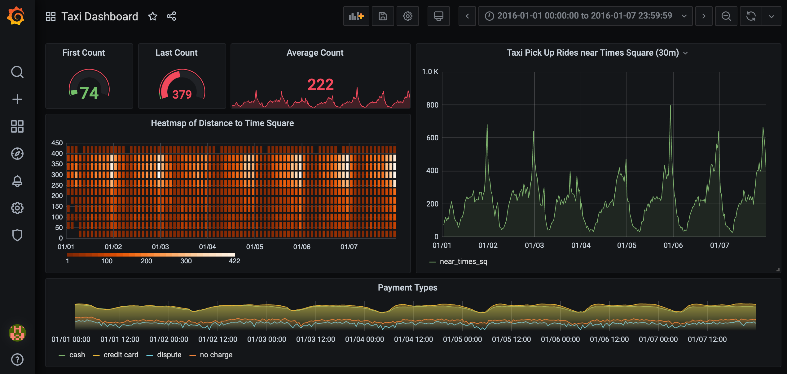

# NYC Taxi Dashboard



## About

New York City is home to more than 8.3 million people. In this dashboard, we can monitor and analyze data from New York’s yellow cab taxis using TimescaleDB in order to identify ways to gain efficiency and reduce greenhouse gas emissions.

## Getting Started

Start all services:

```
docker-compose up -d
```

Load all NYC Data:

```
psql --u postgres -h localhost -d postgres < SQL/nyc_data.sql
```